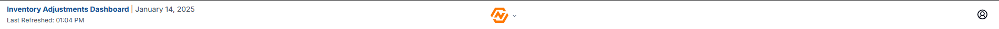

# Inventory Adjustments Dashboard Documentation

## Table of Contents
- [Inventory Adjustments Dashboard Documentation](#inventory-adjustments-dashboard-documentation)
  - [Table of Contents](#table-of-contents)
- [Overview](#overview)
    - [Purpose](#purpose)
- [Nav Bar](#nav-bar)
  - [Information Section](#information-section)
  - [Logo Button](#logo-button)
  - [Menu/Settings](#menusettings)
- [Data Filters](#data-filters)
  - [Date Filter](#date-filter)
    - [***SELECTING A NEW DATE WILL REFRESH THE DATA ON THE PAGE AND CLEAR ANY SELECTIONS!!***\[^1\]](#selecting-a-new-date-will-refresh-the-data-on-the-page-and-clear-any-selections1)
  - [Location Filters](#location-filters)
  - [Inventory Specific Filters](#inventory-specific-filters)
  - [Clearing Filters](#clearing-filters)
- [Tabs](#tabs)
- [Statistics Cards](#statistics-cards)
  - [Static Cards](#static-cards)
  - [Dynamic Cards](#dynamic-cards)
- [Table](#table)

# Overview
The Inventory Adjustments Dashboard is a web application designed to manage and track inventory adjustments across different branches. This documentation provides a comprehensive guide for users at all levels.
### Purpose
- Monitor and manage inventory adjustments
- Review and approve adjustment entries
- Track COGS (Cost of Goods Sold) changes
- Generate insights through metrics and statistics  
 
 
 

# Nav Bar

## Information Section
 - Title of Page
 - Current Date (NOT the date of the data being viewed)
 - Last Refreshed (This will display the time the data on the page was last verified and checked against the server, currently automatically goes every 30 minutes)
  
## Logo Button
   - The **N in Motion** logo is a button that triggers a dropdown menu containing all available filters to manipulate the data, this funcitonality is covered in depth in the [Filters Section](#filters).
   
## Menu/Settings
   - Toggle Theme (dark/light mode)
   - Export As CSV (exports the ***CURRENT TAB*** data only)
   - *More features to come in the future (user profiles, bug reports, export as PDF, etc...)*
 
 
 

# Data Filters

## Date Filter

- Users can select a single date to look at or select 2 dates and see all data within that range.
- If only one date is selected by the user, a dropdown will appear beneath the calendar to provide quick range selections. (see picture) 
   
  ### ***SELECTING A NEW DATE WILL REFRESH THE DATA ON THE PAGE AND CLEAR ANY SELECTIONS!!***[^1]
## Location Filters

- Users can filter the retrieved data based on location in the following ways:
    1. selecting a complete region
    2. selecting specific branches from a specific region
    3. selecting any combination of branches from any region it exists
- Clicking the "All" region button is a way to remove any location filters since the default view includes all branches.
## Inventory Specific Filters

- Users can filter the data based on fields specific to the Inventory Dashboard as well:
    1. COGS minimum value
    2. Buy Line
    3. Prince Line
    4. Adjuster
    5. GL Product Type 
    6. Primary Code (Reviewed Tab ***ONLY***)
## Clearing Filters
- There are 2 buttons to clear filters, this is  because clearing the date filter will refresh, and fetch a brand new set of data to manipulate.
- meanwhile, clearing the other filters just resets the current data set to its most basic form.
 
 
 

# Tabs

-Just something basic about how the data is completely separated into tabs based on the adjustment status, there is no overlap between tabs and when an item is reviewed, or unreviewed, it is immediately removed from the current tab made available in it s new location.

# Statistics Cards
## Static Cards

- These cards are available under a dropdown, and can either show YTD or MTD values, these values are only refreshed on the inital page load and are not affected by any filters, or selections made on the page by the user
## Dynamic Cards

- These cards are always visible under the tab switcher, depending on hte tab selected, the cards may change to show data relevant to the current tab.
- These cards are dynamic and are reflects of the active data, if a filter is applied to the data, it will also change teh values in the cards
- these cards are not only affected by filter selections, but also item selections, if you select 2 items from the table, the cards will only reflect the data you have selected.
 
 
 

# Table
Table Features:
  - sorting by column
  - searching all words
  - rows per page
  - column rearrange
  - item selection
  - pagination
  - 

[^1]: The data is refreshed from the server in 3 situations ***only***: initial page load, auto-refreshes, and changing of the date... all other operations just alter the fetched data for the given range. 
