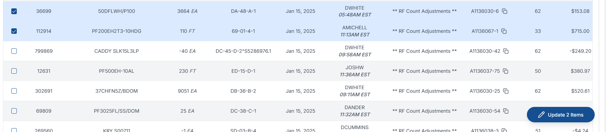

# New Inventory Adjustments Dashboard Features

## Table of Contents

- [Overview](#overview)
- [Navigation Bar](#navigation-bar)
- [Filters](#filters)
- [Tabs](#tabs)
- [Statistics Cards](#statistics-cards)
- [Table](#table)
- [Data Manipulation](#data-manipulation)

# Overview

The Inventory Adjustments Dashboard is a web application designed to manage and track inventory adjustments across different branches. This documentation provides an overview of the new features available on this page.

### Purpose

- Monitor and manage inventory adjustments
- Review and approve adjustment entries
- Track COGS (Cost of Goods Sold) changes
- Generate insights through metrics and statistics
      

# Navigation Bar

## Information Section

- Title of Page
- Current Date (NOT the date of the data being viewed)
- Last Refreshed (Updates every 30 minutes)

## Logo Button

- Triggers dropdown menu containing all available filters
- Quick access to date selection
- Region/Branch selection interface

## Menu/Settings

- Triggers dropdown menu containing page options
- Toggle Theme (dark/light mode)
- Export options
- Future features planned:
  - User profiles
  - Bug reporting
  - PDF exports
        

# Filters

## Date Filter

 

- If only one date is selected by the user, a dropdown will appear beneath the calendar to provide quick range selections. (see picture)
- Single date or date range selection
- Quick range selection dropdown

> [!WARNING]
> Date changes trigger data refresh and clear selections.

## Location Filters

**Filter options:**

1. Complete region selection
2. Specific branches within a region
3. Custom branch combinations across regions

## Inventory Specific Filters

Available filters:

1. COGS minimum value
2. Buy Line
3. Price Line
4. Adjuster
5. GL Product Type
6. Primary Code (Reviewed Tab only)

## Clearing Filters

- Date filter clear: Refreshes data pool from server
- Other filters clear: Resets currently applied filters to dataset view
      

# Statistics Cards

## Static Cards

- MTD/YTD toggle
- Refresh on initial page load only
- Not affected by filters

## Dynamic Cards

- Tab-specific metrics
- Filter-sensitive calculations
- Selection-aware updates
- Real-time data reflection
      

# Tabs

- There are two tabs that completely separate the data based on their adjustment status.
- As items are reviewed or sent back to unreviewed, they will immediately be removed from the current tab, and appear in their new tab.
      

# Table

## Pagination Controls

- Adjustable rows per page
- Page navigation
- Total entries counter
- Selection count indicator

## Core Features

 

- Column Customization

  - Show/hide columns
  - Reorder columns via drag-and-drop

- Data Organization

  - Sort by any column (click column header)
  - Global search across all columns
  - Per-column filtering

- Row Operations
  
  - Single row selection
  - Multi-row selection
  - Bulk actions on selected rows
  - Row hover previews
        

# Data Manipulation

## Single Entry Editing

 

- Edit button triggers modal form
- Required fields validation
- Field-specific rules and constraints
- Real-time validation feedback

## Bulk Operations

 

- Select multiple entries
- Available bulk actions:
  - Status updates
  - Limited primary code assignment
  - Notes addition
  - Group operations

## Group Entry Management

 

> [!IMPORTANT]
> Feature only present in Offsetting and Previous adjustments

- Create entry groups
- Add/remove entries from groups
- Group validation rules
- Offset ledger functionality
